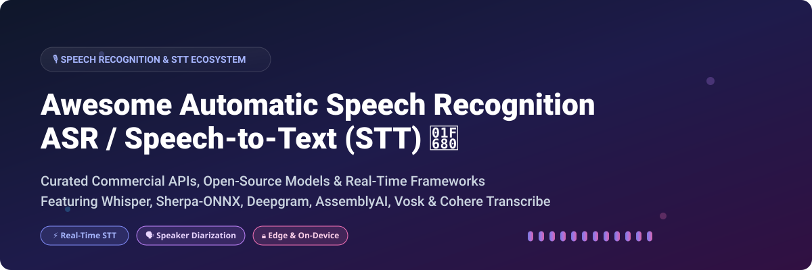

# Awesome-Automatic-Speech-Recognition-ASR-STT

# Awesome-Automatic-Speech-Recognition-ASR-STT 🎙️ 📝



  





  
  
  
  
  
  



---

## 🌟 Top Automatic Speech Recognition (ASR / STT) Ecosystem

**Curated List of Commercial Speech-to-Text APIs & Open-Source ASR Frameworks**  
*Focused on Real-Time Transcription, Multilingual Recognition, Speaker Diarization, On-Device Inference & Self-Hosted Speech Pipelines*  

**Last updated: October 2026** 📅

---

### 📌 Overview & SEO Summary
Welcome to the ultimate curated directory of **automatic speech recognition platforms**, **open-source ASR models**, and **real-time transcription frameworks**. Whether you are looking for enterprise-grade commercial APIs (such as *Deepgram*, *AssemblyAI*, and *Speechmatics*), or self-hostable open-source alternatives (like *Whisper*, *Sherpa-ONNX*, *Vosk*, and *Cohere Transcribe*), this list covers category leaders, edge-optimized engines, and privacy-respecting speech recognition pipelines.

---

## 📑 Table of Contents
- [🏢 SaaS & Commercial Platforms](#-saas--commercial-platforms)
- [🔓 Open-Source GitHub Projects](#-open-source-github-projects)
- [🛠️ How to Contribute](#%EF%B8%8F-how-to-contribute)
- [📊 Star History](#-star-history)
- [🤝 Support & Sponsorship](#-support--sponsorship)
- [⚠️ Disclaimer](#%EF%B8%8F-disclaimer)

---

## 🏢 SaaS / Commercial Platforms

The automatic speech recognition market is dominated by cloud-based APIs offering real-time streaming, high accuracy, and global language coverage. Pricing models are typically consumption-based per minute or per hour of audio. Deepgram charges per minute with pay-as-you-go pricing, AssemblyAI offers a free tier with $50 in credits and per-hour pricing for its Universal models, Speechmatics uses per-hour pricing with volume discounts, and cloud hyperscalers (Google, Azure, AWS) charge per minute for standard and enhanced models. Recent benchmarks show AssemblyAI's Universal models achieve roughly 30% fewer hallucinations than Whisper large-v3 .

| SaaS / Commercial Platform | Company / Owner | Valuation / Market Cap | Standard Edition Starting Price | Free Tier / Free Trial Limits | Description |
| :--- | :--- | :--- | :--- | :--- | :--- |
| **[Amazon Transcribe](https://aws.amazon.com/transcribe/)** ☁️ | Amazon | ~$2.0 Trillion | $0.024/minute (first 250K min/month) | **Free tier: 60 minutes/month for 12 months** | **AWS-native speech-to-text** — Real-time streaming and batch transcription. Custom vocabulary, speaker diarization, and medical transcription. Integrates with S3, Lambda, and Transcribe Medical. |
| **[Deepgram](https://deepgram.com/)** 🟢 | Deepgram | Private | $0.0043/minute (Nova-3, pay-as-you-go)  | **$200 free credits for new accounts** | **Real-time ASR with Nova-3** — Streaming transcription with keyterm prompting, speaker diarization, and smart formatting. Enterprise-grade SLAs. |
| **[Whisper Cloud (OpenAI)](https://platform.openai.com/docs/guides/speech-to-text)** 🔵 | OpenAI | ~$80 Billion | $0.006/minute (Whisper) | **No free tier**; pay-as-you-go | **OpenAI's hosted Whisper** — Multilingual speech recognition, translation, and language identification. Supports 99 languages. The API version of the open-source model. |
| **[AssemblyAI](https://www.assemblyai.com/)** 🟣 | AssemblyAI | Private | $0.15/hour (Universal)  | **$50 free credits** | **Developer-first speech AI** — Universal-3.5 Pro models with ~30% fewer hallucinations than Whisper. Real-time streaming, speaker diarization, and entity detection. |
| **[Google Cloud Speech-to-Text](https://cloud.google.com/speech-to-text)** 🌐 | Google (Alphabet) | ~$2.0 Trillion | $0.016/minute (standard); $0.024 (enhanced) | **Free tier: 60 minutes/month** | **Google's speech recognition** — Chirp models for multilingual transcription. Real-time streaming, speaker diarization, and automatic punctuation. |
| **[Azure AI Speech](https://azure.microsoft.com/en-us/products/ai-services/speech-to-text)** 🔷 | Microsoft | ~$3.90 Trillion | $0.0167/minute (standard); $0.024 (enhanced) | **Free tier: 5 hours/month** | **Microsoft's speech service** — Real-time and batch transcription. Custom speech models, pronunciation assessment, and speaker diarization. |
| **[Speechmatics](https://www.speechmatics.com/)** 🎯 | Speechmatics | Private | Custom per-hour pricing | **Free trial available** | **Enterprise ASR with global language coverage** — 50+ languages, real-time streaming, and batch transcription. Focus on accuracy and compliance. |
| **[Rev AI](https://www.rev.com/api)** 📝 | Rev.com | Private | $0.02/minute (machine); human transcription available | **Free tier: 300 minutes** | **Hybrid machine + human transcription** — Machine ASR for speed, human transcription for accuracy. Speaker diarization and custom vocabulary. |
| **[Gladia](https://www.gladia.io/)** 🎧 | Gladia | Private | Custom per-minute pricing | **Free tier: 10 hours/month** | **Real-time speech-to-text API** — Multilingual transcription with speaker diarization, sentiment analysis, and audio intelligence. |
| **[Sonix](https://sonix.ai/)** 🎬 | Sonix | Private | $10/hour (pay-as-you-go); subscription plans available | **Free trial: 30 minutes** | **Automated transcription platform** — 40+ languages, speaker labels, timestamps, and translation. Browser-based with API access. |

---

## 🔓 Open-Source GitHub Projects

*Sorted by GitHub_Stars_Count (Descending)* 🌟

- **[OpenAI Whisper](https://github.com/openai/whisper)**   
  **The foundational open-source ASR model**, MIT licensed. ~80k+ stars. Transformer sequence-to-sequence model trained on 680,000 hours of multilingual data. Six model sizes: tiny (39M), base (74M), small (244M), medium (769M), large (1550M), and turbo (809M) . Supports 99 languages, speech translation, and language identification. Runs on CPU and GPU. The de facto standard for open-source speech recognition. 🌍

- **[whisper.cpp](https://github.com/ggerganov/whisper.cpp)**   
  **High-performance C/C++ port of Whisper**, MIT licensed. ~35k+ stars. CPU inference with minimal dependencies. Runs on edge devices, Raspberry Pi, and mobile. Quantization support for reduced memory footprint. The foundation for countless Whisper-based applications . ⚡

- **[faster-whisper](https://github.com/SYSTRAN/faster-whisper)**   
  **Faster Whisper reimplementation using CTranslate2**, MIT licensed. ~15k+ stars. **Up to 4x faster** than original Whisper with lower memory usage. Supports int8 quantization for CPU inference. Same models and languages as Whisper. Used in YazSes for CPU-based dictation with 4.07% WER on LibriSpeech . 🏎️

- **[WhisperX](https://github.com/m-bain/whisperX)**   
  **Whisper with word-level timestamps and speaker diarization**, BSD-2-Clause licensed. ~15k+ stars. Adds fast automatic speaker recognition (via pyannote-audio) and word-level timestamps. Ideal for meeting transcription and subtitle generation . 🗣️

- **[Vosk](https://github.com/alphacep/vosk-api)**   
  **Offline speech recognition toolkit**, Apache-2.0 licensed. ~10k+ stars. **Lightweight models (50MB)** for 20+ languages. Real-time streaming API with zero-latency response. Runs on Raspberry Pi, Android, and iOS . Lower accuracy than Whisper but **best for edge devices and resource-constrained environments** . 🍓

- **[Sherpa-ONNX](https://github.com/k2-fsa/sherpa-onnx)**   
  **Next-gen Kaldi with ONNX Runtime**, Apache-2.0 licensed. ~8k+ stars. **Lowest error rates on desktop platforms** in IEEE benchmarks . Supports ASR, TTS, speaker diarization, and VAD. 12 programming language bindings. Offline and streaming modes. Used in Parakeet Type Ubuntu for CPU-only local dictation . 🎯

- **[NVIDIA NeMo](https://github.com/NVIDIA/NeMo)**   
  **Enterprise ASR toolkit with Conformer and Parakeet models**, Apache-2.0 licensed. ~12k+ stars. GPU-accelerated training and inference. Parakeet models optimized for edge deployment. Used in Parakeet.cpp for lightweight C++ inference (~500MB quantized) . 🚀

- **[Cohere Transcribe](https://cohere.com/blog/transcribe)**   
  **State-of-the-art open-source ASR model**, Apache-2.0 licensed. **#1 on HuggingFace Open ASR Leaderboard with 5.42% average WER** . 2B parameter Conformer encoder-decoder. Trained on 14 languages including English, Mandarin, Japanese, Korean, and Arabic. Outperforms Whisper Large v3, ElevenLabs Scribe v2, and Qwen3-ASR-1.7B. Best for **highest accuracy in real-world conditions** . 🏆

- **[Distil-Whisper](https://github.com/huggingface/distil-whisper)**   
  **Distilled Whisper variants from Hugging Face**, MIT licensed. ~5k+ stars. **6x faster** than Whisper while retaining ~99% accuracy. 49% smaller model size. English-focused. Best for **speed-critical applications** . 💨

- **[Qwen3-ASR](https://github.com/QwenLM/Qwen3-ASR)**   
  **Alibaba's multilingual ASR model**, Apache-2.0 licensed. **Supports 52 languages and dialects**. Model sizes: 0.6B, 1.7B, and ForcedAligner-0.6B . vLLM backend for fast inference and streaming. **Best for Asian language coverage and multilingual applications** . 🌏

- **[VibeVoice-ASR](https://github.com/microsoft/VibeVoice)**   
  **Microsoft's long-form ASR with speaker diarization**, MIT licensed (ASR model). **Transcribes 60 minutes of audio in one pass** using 64K token context window. Three-in-one output: speaker identification, timestamps, and transcription. Supports 50+ languages with hotword customization . **Best for long meetings and podcasts** without segmentation. 📅

- **[FunASR](https://github.com/alibaba-damo-academy/FunASR)**   
  **Industrial-grade ASR toolkit from Alibaba**, MIT licensed. ~10k+ stars. Paraformer and SenseVoice models. **0.8B parameters achieving performance of 12B models** . Offline file transcription SDK and real-time transcription service. Optimized for Chinese and Asian languages . 🏭

- **[SpeechBrain](https://github.com/speechbrain/speechbrain)**   
  **PyTorch-based speech toolkit**, Apache-2.0 licensed. ~8k+ stars. ASR, speaker recognition, speech enhancement, and separation. Research-focused with reproducible recipes. Used in edge deployment benchmarks . 🔬

- **[WhisperLive](https://github.com/collabora/WhisperLive)**   
  **Real-time transcription server**, MIT licensed. ~2k+ stars. WebSocket-based server for streaming Whisper transcription. Supports multiple concurrent clients. Integrates with OBS for live captions . 📡

- **[whisper_streaming](https://github.com/ufal/whisper_streaming)**   
  **Long-form streaming transcription**, MIT licensed. ~2k+ stars. Implements LocalAgreement policy for real-time Whisper inference. Handles arbitrarily long audio with low latency. Used in production streaming applications . 🌊

- **[Sussurro](https://github.com/cesp99/sussurro)**   
  **Fully local voice-to-text with LLM cleanup**, open-source. Uses **Whisper.cpp for ASR** and a fine-tuned Qwen 3 LLM for text cleanup. Native overlay UI shows recording/transcribing state. Removes filler words and handles self-corrections. **No data leaves your machine** . ✨

- **[YazSes](https://github.com/MSKazemi/yazses)**   
  **Hold-to-talk dictation for Linux, macOS, and Windows**, open-source. Uses **faster-whisper with int8 CPU inference** (no GPU required). 4.07% WER on LibriSpeech with base.en model. Median decode time 1.56s. Supports voice commands ("undo that", "save file"), Meeting Mode with speaker labels, and offline file transcription. **Everything runs on CPU — no network, no GPU** . 🎤

- **[Buzz](https://github.com/chidiwilliams/buzz)**   
  **Cross-platform desktop transcription app**, MIT licensed. ~10k+ stars. Feature-rich GUI for Whisper. Transcription and translation. Runs offline with CPU or GPU . 🐝

- **[MacWhisper](https://goodsnooze.gumroad.com/l/macwhisper)**   
  **macOS transcription app (freemium)**, proprietary with open-source components. ~5k+ stars. Native macOS app for Whisper transcription. Drag-and-drop audio files. Speaker diarization and subtitle export . 🍎

- **[Speech Note (Linux)](https://github.com/mkiol/dsnote)**   
  **Linux transcription app with multiple ASR engines**, GPL-3.0 licensed. ~1k+ stars. Supports Whisper, Vosk, and more. Offline transcription for Linux desktop . 🐧

---

## 🛠️ How to Contribute

Contributions are welcome! Follow these steps to submit new ASR platforms or open-source speech recognition software:

1. 🍴 **Fork** the repository.
2. 📝 **Add/edit** entries in `README.md` maintaining table/list structure and formatting.
3. 🔗 Include project title, official website/GitHub link, exact Stars_Count, license, and brief description.
4. 🚀 Submit a **Pull Request** with a descriptive summary of your changes.

---

## 📊 Star History



---

## 🤝 Support & Sponsorship

If you find this automatic speech recognition repository useful, please consider supporting the project:

- ⭐ **Star** this repository to increase visibility!
- 🔀 **Fork** and share with fellow developers, speech researchers, and open-source advocates.
- ☕ **Sponsor & Buy Me a Coffee**: Support ongoing open-source curation via the [GitHub Sponsor Dashboard](https://github.com/sponsors/ishandutta2007).

---

## ⚠️ Disclaimer

- This is a **community-curated** list — not exhaustive and not an endorsement. ℹ️
- ASR performance is **deployment-dependent rather than universal**. IEEE benchmarks show Sherpa-ONNX achieves lowest error rates on desktop, Silero provides lowest CPU latency for interactive use, and Whisper delivers highest throughput under GPU acceleration . **Benchmark for your specific hardware and language requirements** before committing.
- Open-source ASR tools (Whisper, Sherpa-ONNX, Vosk) provide self-hosted ownership and offline capability, but enterprise-grade SLA guarantees, managed scaling, and 24/7 support remain primarily commercial offerings. Whisper has a documented hallucination tendency — roughly 1% of transcriptions contain fabricated phrases, while AssemblyAI's Universal models show ~30% fewer hallucinations . 🎙️

---



  <b>Made with ❤️ for speech researchers, developers, and open-source ASR advocates.</b>

